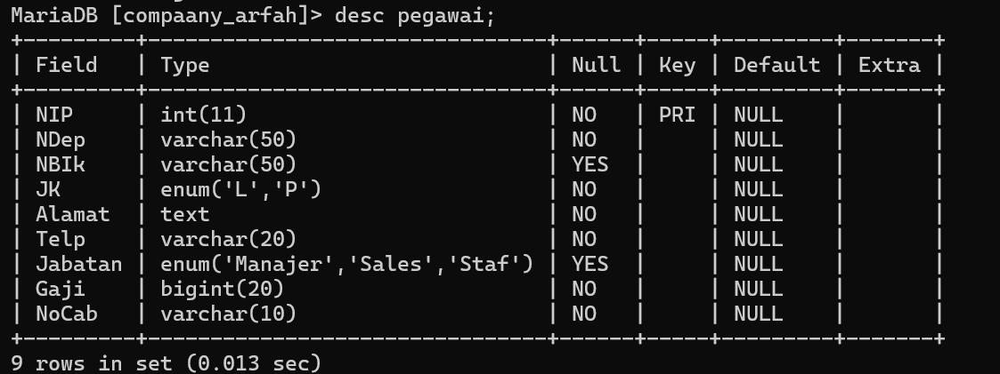
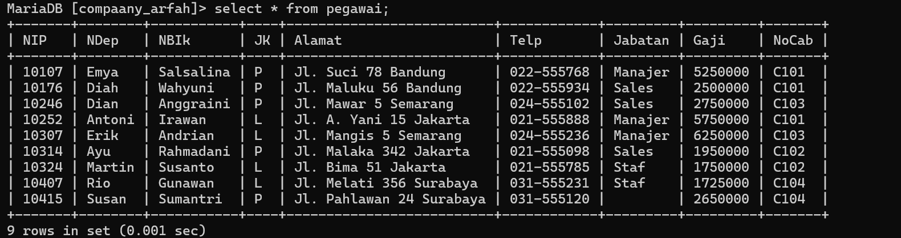

# DESC
**Penjelasan** : Dalam MySQL, `DESC` adalah singkatan dari "DESCRIBE". Perintah `DESCRIBE` digunakan untuk menampilkan struktur dari tabel yang ada dalam database. Dengan menggunakan `DESCRIBE`, Anda bisa mendapatkan informasi mengenai kolom-kolom dalam tabel, termasuk nama kolom, tipe data, apakah kolom tersebut dapat bernilai `NULL` atau tidak, dan atribut lainnya seperti kunci primer (primary key) atau default value.

**Contoh :
~~~sql
desc pegawai;
~~~

**Hasilnya** :

**Kesimpulan :**

Secara keseluruhan, tabel `pegawai` dirancang dengan kolom `id` sebagai identifikasi unik yang bertambah otomatis, sementara kolom `nama` adalah wajib diisi, dan kolom `jabatan` serta `tanggal_lahir` bersifat opsional. Ini mencerminkan struktur dasar dari tabel yang mungkin digunakan untuk menyimpan data pegawai dengan informasi kunci seperti nama, jabatan, dan tanggal lahir.

# SELECT
**Penjelasan :** Perintah `SELECT` dalam MySQL digunakan untuk mengambil data dari tabel dalam database. Ini adalah perintah dasar dan paling sering digunakan dalam SQL untuk menampilkan data. Anda bisa menggunakan `SELECT` untuk memilih kolom tertentu, menggabungkan tabel, melakukan filter data, dan banyak lagi.

**Contoh :**
~~~sql
select * from pegawai;
~~~

**Hasil :**

**Kesimpulan :**
Perintah `SELECT * FROM pegawai;` berguna untuk melihat seluruh data dalam tabel `pegawai` tanpa batasan atau filter. Ini adalah cara cepat untuk mendapatkan gambaran lengkap tentang data yang ada di tabel, tetapi untuk analisis yang lebih spesifik atau untuk meningkatkan performa query, sebaiknya Anda memilih kolom tertentu dan menerapkan kondisi yang sesuai.

1